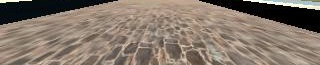

# **Udacity Self-Driving Car Engineer Nanodegree - Behavioral Cloning Project**

---

**Note: This project makes use of a Udacity-developed driving simulator and training data collected from the simulator (neither of which is included in this repo).**

---

**Behavioral Cloning Project**

The goals / steps of this project are the following:
* Use the simulator to collect data of good driving behavior
* Build, a convolution neural network in Keras that predicts steering angles from images
* Train and validate the model with a training and validation set
* Test that the model successfully drives around track one without leaving the road
* Summarize the results with a written report


[//]: # (Image References)

[image1]: ./examples/placeholder.png "Model Visualization"
[image2]: ./examples/placeholder.png "Grayscaling"
[image3]: ./examples/placeholder_small.png "Recovery Image"
[image4]: ./examples/placeholder_small.png "Recovery Image"
[image5]: ./examples/placeholder_small.png "Recovery Image"
[image6]: ./examples/placeholder_small.png "Normal Image"
[image7]: ./examples/placeholder_small.png "Flipped Image"

## Rubric Points
### Here I will consider the [rubric points](https://review.udacity.com/#!/rubrics/432/view) individually and describe how I addressed each point in my implementation.  


### Introduction
The objective of this project is to train the computer to drive car on the basis of data collected in simulator provided by Udacity [here](.amazonaws.com/video.udacity-data.com/topher/2016/December/584f6edd_data/data.zip). We apply the concepts of Deep Learning and Convolutional Neural Networks to teach the computer to drive car autonomously.

We feed the data collected from Simulator to our model, this data is feed in the form of images captured by 3 dashboard cameras center, left and right. The output data contains a file data.csv which has the mappings of center, left and right images and the corresponding steering angle, throttle, brake and speed.

Using Keras Deep learning framework we can create a model.h5 file which we can test later on simulator with the command "python drive.py model.h5". This drive.py connects your model to simulator. The challenge in this project is to collect all sorts of training data so as to train the model to respond correctly in any type of situation.

---

### CODE

My project includes the following files:
* model.py containing the script to create and train the model
* drive.py for driving the car in autonomous mode
* model.h5 containing a trained convolution neural network 
* writeup_report.md or writeup_report.pdf summarizing the results`


Using the Udacity provided simulator and my drive.py file, the car can be driven autonomously around the track by executing 
```sh
python drive.py model.h5
```

The model.py file contains the code for training and saving the convolution neural network. The file shows the pipeline I used for training and validating the model, and it contains comments to explain how the code works.

---

###  Model Overview


* I decided to test the model provided by NVIDIA as suggested by Udacity. The model architecture is described by NVIDIA [here](https://images.nvidia.com/content/tegra/automotive/images/2016/solutions/pdf/end-to-end-dl-using-px.pdf). As an input this model takes in image of the shape (60,266,3) but our dashboard images/training images are of size (160,320,3). I decided to keep the architecture of the remaining model same but instead feed an image of different input shape which I will discuss later.


### Loading Data and PreProcessing

* I take the the dataset provided by Udacity
* I am using OpenCV to load the images, as in OpenCV the images are read in BGR format but we need to convert to RGB as in drive.py it is processed in RGB format.
* Since we have a steering angle associated with three images we introduce a correction factor for left and right images since the steering angle is captured by the center angle.
* I decided to introduce a correction factor of 0.2
* For the left images I increase the steering angle by 0.2 and for the right images I decrease the steering angle by 0.2
* Sample Image
* I shuffle the images so that the order in which images comes doesn't matters to the CNN
* Augmenting the data- i flip the image horizontally and adjust steering angle accordingly, I used cv2 to flip the images.We also used rotating , resizing for data argumentation.
* In augmenting after flipping multiply the steering angle by a factor of -1 to get the steering angle for the flipped image.
* So according to this approach we were able to generate 6 images corresponding to one entry in .csv file...3 from 3 cameras and other three from rotating the images horizontally.


### Creation of the Training Set & Validation Set

* I analyzed the Udacity Dataset and found out that it contains 9 laps of track 1 with recovery data. I was satisfied with the data and decided to move on.
* I split the dataset into training and validation set using sklearn preprocessing library.
* I keep 15% of the data in Validation Set and remaining in Training Set
* I am using generator to generate the data so as to avoid loading all the images in the memory and instead generate it at the run time in batches of 32. Even Augmented images are generated inside the generators.

### Final Model Architecture


* As my first step is to apply normalization to the all the images.
* Second step is to crop the image 70 pixels from top and 25 pixels from bottom. The image was cropped from top because I did not wanted to distract the model with trees and sky and 25 pixels from the bottom so as to remove the dashboard that is coming in the images.This will lead to better results.

Sample Input Image-
   

Cropped Image-



* Then Next Step is to define the first convolutional layer with filter depth as 24 and filter size as (5,5) with (2,2) stride followed by ELU activation function
* Moving on to the second convolutional layer with filter depth as 36 and filter size as (5,5) with (2,2) stride followed by ELU activation function 
* The third convolutional layer with filter depth as 48 and filter size as (5,5) with (2,2) stride followed by ELU activation function
* After that we define two convolutional layer with filter depth as 64 and filter size as (3,3) and (1,1) stride followed by ELU activation funciton
* After applying convolution layer Next step is to flatten the output from 2D to side by side
* Here we apply first fully connected layer with 100 outputs
* Here is the first time when we introduce Dropout with Dropout rate as 0.25 to reduce the chance of overfitting
* Next we introduce second fully connected layer with 50 outputs
* Then comes a third connected layer with 10 outputs
* At last the layer with one output.

Here we require one output just because this is a regression problem and we need to predict the steering angle.


### Attempts to reduce overfitting in the model
After the full connected layer I have used a dropout so that the model generalizes on a track that it has not seen. I decided to keep the Dropoout rate as 0.25 to reduce the chance of overfitting.


### Model parameter tuning

* No of epochs= 5
* Optimizer Used- Adam which is most used optimizer 
* Learning Rate- 0.001 best default value
* Validation Data split- 0.15   85/15 ratio
* Generator batch size= 32
* Correction factor- 0.2  which is apply both left and right side
* Loss Function Used- MSE(Mean Squared Error as it is efficient for regression problem).


### Output Video
[](https://www.youtube.com/watch?v=W_cMN_75Ig4)

---

### Tips
- Please keep in mind that training images are loaded in BGR colorspace using cv2 while drive.py load images in RGB to predict the steering angles.
