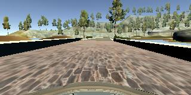

# **Udacity Self-Driving Car Engineer Nanodegree - Behavioral Cloning Project**

---

**Note: This project makes use of a Udacity-developed driving simulator and training data collected from the simulator (neither of which is included in this repo).**

---

**Behavioral Cloning Project**

The goals / steps of this project are the following:
* Use the simulator to collect data of good driving behavior
* Build, a convolution neural network in Keras that predicts steering angles from images
* Train and validate the model with a training and validation set
* Test that the model successfully drives around track one without leaving the road
* Summarize the results with a written report


[//]: # (Image References)

[image1]: ./examples/placeholder.png "Model Visualization"
[image2]: ./examples/placeholder.png "Grayscaling"
[image3]: ./examples/placeholder_small.png "Recovery Image"
[image4]: ./examples/placeholder_small.png "Recovery Image"
[image5]: ./examples/placeholder_small.png "Recovery Image"
[image6]: ./examples/placeholder_small.png "Normal Image"
[image7]: ./examples/placeholder_small.png "Flipped Image"

## Rubric Points
### Here I will consider the [rubric points](https://review.udacity.com/#!/rubrics/432/view) individually and describe how I addressed each point in my implementation.  


### Introduction
The objective of this project is to teach the computer to drive car on on the basis of data collected in simulator provided by Udacity [here](.amazonaws.com/video.udacity-data.com/topher/2016/December/584f6edd_data/data.zip). Here we apply the concepts of Deep Learning and Convolutional Neural Networks to teach the computer to drive car autonomously.

We feed the data collected from Simulator to our model, this data is fed in the form of images captured by 3 dashboard cams center, left and right. The output data contains a file data.csv which has the mappings of center, left and right images and the corresponding steering angle, throttle, brake and speed.

Using Keras Deep learning framework we can create a model.h5 file which we can test later on simulator with the command "python drive.py model.h5". This drive.py connects your model to simulator. The challenge in this project is to collect all sorts of training data so as to train the model to respond correctly in any type of situation.

---

### Files Submitted & Code Quality

#### 1. Submission includes all required files and can be used to run the simulator in autonomous mode

My project includes the following files:
* model.py containing the script to create and train the model
* model.ipynb python notebook containing the code to create and train the model
* drive.py for driving the car in autonomous mode
* model.h5 containing a trained convolution neural network 
* writeup_report.md  summarizing the results

#### 2. Submission includes functional code

Using the Udacity provided simulator and my drive.py file, the car can be driven autonomously around the track by executing 
```sh
python drive.py model.h5
```

#### 3. Submission code is usable and readable

The model.py file contains the code for training and saving the convolution neural network. The file shows the pipeline I used for training and validating the model, and it contains comments to explain how the code works.

---


## Model Architecture and Training Strategy


###  Model Overview


* I decided to test the model provided by NVIDIA as suggested by Udacity. The model architecture is described by NVIDIA [here](https://images.nvidia.com/content/tegra/automotive/images/2016/solutions/pdf/end-to-end-dl-using-px.pdf). As an input this model takes in image of the shape (60,266,3) but our dashboard images/training images are of size (160,320,3). I decided to keep the architecture of the remaining model same but instead feed an image of different input shape which I will discuss later.


### Loading Data 

* I used the the dataset provided by Udacity
* I am using OpenCV to load the images, by default the images are read by OpenCV in BGR format but we need to convert to RGB as in drive.py it is processed in RGB format.
* Since we have a steering angle associated with three images we introduce a correction factor for left and right images since the steering angle is captured by the center angle.
* I decided to introduce a correction factor of 0.2
* For the left images I increase the steering angle by 0.2 and for the right images I decrease the steering angle by 0.2
* Sample Image


### Preprocessing

* I decided to shuffle the images so that the order in which images comes doesn't matters to the CNN
* Augmenting the data- i decided to flip the image horizontally and adjust steering angle accordingly, I used cv2 to flip the images.
* In augmenting after flipping multiply the steering angle by a factor of -1 to get the steering angle for the flipped image.
* So according to this approach we were able to generate 6 images corresponding to one entry in .csv file


### Creation of the Training Set & Validation Set

* I analyzed the Udacity Dataset and found out that it contains 9 laps of track 1 with recovery data. I was satisfied with the data and decided to move on.
* I decided to split the dataset into training and validation set using sklearn preprocessing library.
* I decided to keep 15% of the data in Validation Set and remaining in Training Set
* I am using generator to generate the data so as to avoid loading all the images in the memory and instead generate it at the run time in batches of 32. Even Augmented images are generated inside the generators.

### Final Model Architecture

* I made a little changes to the original NVIDIA architecture, my final architecture looks like in the image below


* As it is clear from the model summary my first step is to apply normalization to the all the images.
* Second step is to crop the image 70 pixels from top and 25 pixels from bottom. The image was cropped from top because I did not wanted to distract the model with trees and sky and 25 pixels from the bottom so as to remove the dashboard that is coming in the images.

Sample Input Image-
   

Cropped Image-


* Next Step is to define the first convolutional layer with filter depth as 24 and filter size as (5,5) with (2,2) stride followed by ELU activation function
* Moving on to the second convolutional layer with filter depth as 36 and filter size as (5,5) with (2,2) stride followed by ELU activation function 
* The third convolutional layer with filter depth as 48 and filter size as (5,5) with (2,2) stride followed by ELU activation function
* Next we define two convolutional layer with filter depth as 64 and filter size as (3,3) and (1,1) stride followed by ELU activation funciton
* Next step is to flatten the output from 2D to side by side
* Here we apply first fully connected layer with 100 outputs
* Here is the first time when we introduce Dropout with Dropout rate as 0.25 to combact overfitting
* Next we introduce second fully connected layer with 50 outputs
* Then comes a third connected layer with 10 outputs
* And finally the layer with one output.

Here we require one output just because this is a regression problem and we need to predict the steering angle.


### Attempts to reduce overfitting in the model
After the full connected layer I have used a dropout so that the model generalizes on a track that it has not seen. I decided to keep the Dropoout rate as 0.25 to combact overfitting.


### Model parameter tuning

* No of epochs= 5
* Optimizer Used- Adam
* Learning Rate- Default 0.001
* Validation Data split- 0.15
* Generator batch size= 32
* Correction factor- 0.2
* Loss Function Used- MSE(Mean Squared Error as it is efficient for regression problem).

After a lot of testing on track 1 I was convinced that this is my final model.

### Output Video
[](https://www.youtube.com/watch?v=BMJi_tcetdQ)


#### Simulator problem in GPU
* I noticed that running simulator on GPU had a problem with latest tensorflow and keras versions.
* "Cudnn handle cannot be initialized" is the error that I used to get while running the simulator. Workaround for this problem is to create a new environment with tensoflow instead of tensorflow-gpu and run simulator in that environment. Make sure to install other important libraries in new environment as well like eventlet, python-socketio which are required by drive.py to run.

#### Memory Leak
* I noticed a memory leak with keras verison 2.1 and tensorflow 1.2 so i decided to downgrade the keras to 1.2.1 and tensorflow to 0.12


---
### Files Submitted & Code Quality

#### 1. Submission includes all required files and can be used to run the simulator in autonomous mode

My project includes the following files:
* model.py containing the script to create and train the model
* drive.py for driving the car in autonomous mode
* model.h5 containing a trained convolution neural network 
* writeup_report.md or writeup_report.pdf summarizing the results

#### 2. Submission includes functional code
Using the Udacity provided simulator and my drive.py file, the car can be driven autonomously around the track by executing 
```sh
python drive.py model.h5
```

#### 3. Submission code is usable and readable

The model.py file contains the code for training and saving the convolution neural network. The file shows the pipeline I used for training and validating the model, and it contains comments to explain how the code works.

### Model Architecture and Training Strategy

#### 1. An appropriate model architecture has been employed

My model consists of a convolution neural network with 3x3 filter sizes and depths between 32 and 128 (model.py lines 18-24) 

The model includes RELU layers to introduce nonlinearity (code line 20), and the data is normalized in the model using a Keras lambda layer (code line 18). 

#### 2. Attempts to reduce overfitting in the model

The model contains dropout layers in order to reduce overfitting (model.py lines 21). 

The model was trained and validated on different data sets to ensure that the model was not overfitting (code line 10-16). The model was tested by running it through the simulator and ensuring that the vehicle could stay on the track.

#### 3. Model parameter tuning

The model used an adam optimizer, so the learning rate was not tuned manually (model.py line 25).

#### 4. Appropriate training data

Training data was chosen to keep the vehicle driving on the road. I used a combination of center lane driving, recovering from the left and right sides of the road ... 

For details about how I created the training data, see the next section. 

### Model Architecture and Training Strategy

#### 1. Solution Design Approach

The overall strategy for deriving a model architecture was to ...

My first step was to use a convolution neural network model similar to the ... I thought this model might be appropriate because ...

In order to gauge how well the model was working, I split my image and steering angle data into a training and validation set. I found that my first model had a low mean squared error on the training set but a high mean squared error on the validation set. This implied that the model was overfitting. 

To combat the overfitting, I modified the model so that ...

Then I ... 

The final step was to run the simulator to see how well the car was driving around track one. There were a few spots where the vehicle fell off the track... to improve the driving behavior in these cases, I ....

At the end of the process, the vehicle is able to drive autonomously around the track without leaving the road.

#### 2. Final Model Architecture

The final model architecture (model.py lines 18-24) consisted of a convolution neural network with the following layers and layer sizes ...

Here is a visualization of the architecture (note: visualizing the architecture is optional according to the project rubric)

![alt text][image1]

#### 3. Creation of the Training Set & Training Process

To capture good driving behavior, I first recorded two laps on track one using center lane driving. Here is an example image of center lane driving:

![alt text][image2]

I then recorded the vehicle recovering from the left side and right sides of the road back to center so that the vehicle would learn to .... These images show what a recovery looks like starting from ... :

![alt text][image3]
![alt text][image4]
![alt text][image5]

Then I repeated this process on track two in order to get more data points.

To augment the data sat, I also flipped images and angles thinking that this would ... For example, here is an image that has then been flipped:

![alt text][image6]
![alt text][image7]

Etc ....

After the collection process, I had X number of data points. I then preprocessed this data by ...


I finally randomly shuffled the data set and put Y% of the data into a validation set. 

I used this training data for training the model. The validation set helped determine if the model was over or under fitting. The ideal number of epochs was Z as evidenced by ... I used an adam optimizer so that manually training the learning rate wasn't necessary.


### Tips
- Please keep in mind that training images are loaded in BGR colorspace using cv2 while drive.py load images in RGB to predict the steering angles.
