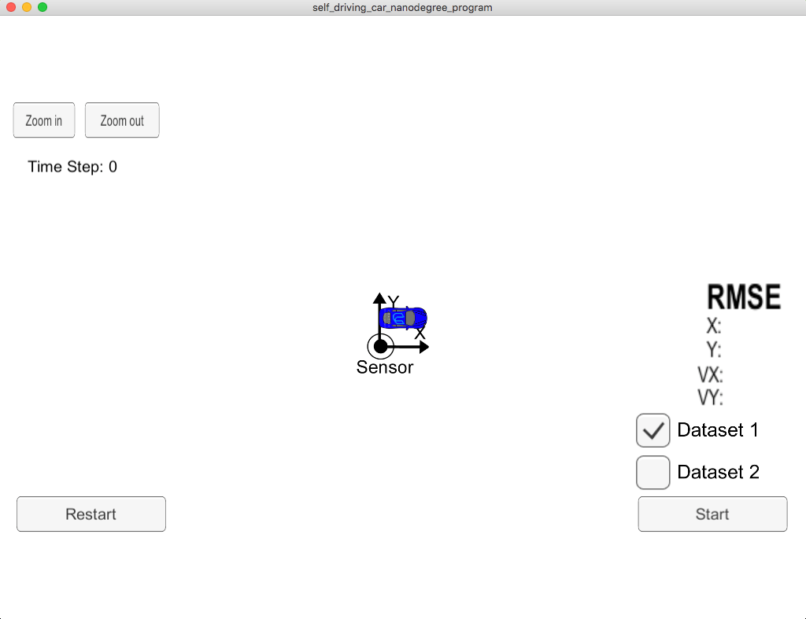
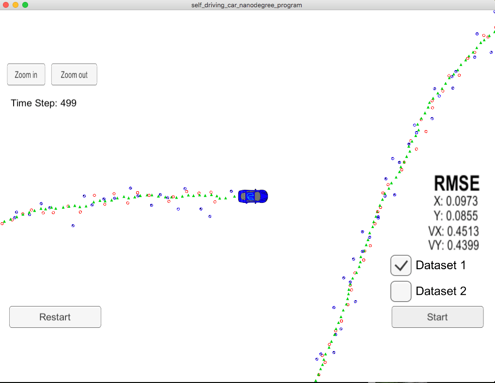

# CarND-Extended-Kalman-Filter-P1
Udacity Self-Driving Car Nanodegree - Extended Kalman Filter Implementation

# Overview
This project consists of implementing an [Extended Kalman Filter](https://en.wikipedia.org/wiki/Extended_Kalman_filter) with C++. A simulator provided by Udacity ([it could be downloaded here](https://github.com/udacity/self-driving-car-sim/releases)) generates noisy RADAR and LIDAR measurements of the position and velocity of an object, and the Extended Kalman Filter[EKF] must fusion those measurements to predict the position of the object. The communication between the simulator and the EKF is done using [WebSocket](https://en.wikipedia.org/wiki/WebSocket) using the [uWebSockets](https://github.com/uNetworking/uWebSockets) implementation on the EKF side.
To get this project started, Udacity provides a seed project that could be found (here)(https://github.com/udacity/CarND-Extended-Kalman-Filter-Project).

## Other Important Dependencies

* cmake >= 3.5
  * All OSes: [click here for installation instructions](https://cmake.org/install/)
* make >= 4.1 (Linux, Mac), 3.81 (Windows)
  * Linux: make is installed by default on most Linux distros
  * Mac: [install Xcode command line tools to get make](https://developer.apple.com/xcode/features/)
  * Windows: [Click here for installation instructions](http://gnuwin32.sourceforge.net/packages/make.htm)
* gcc/g++ >= 5.4
  * Linux: gcc / g++ is installed by default on most Linux distros
  * Mac: same deal as make - [install Xcode command line tools](https://developer.apple.com/xcode/features/)
  * Windows: recommend using [MinGW](http://www.mingw.org/)

## Basic Build Instructions

1. Clone this repo.
2. Make a build directory: `mkdir build && cd build`
3. Compile: `cmake .. && make` 
   * On windows, you may need to run: `cmake .. -G "Unix Makefiles" && make`
4. Run it: `./ExtendedKF `


For instructions on how to install these components on different operating systems, please, visit [Udacity's seed project](https://github.com/udacity/CarND-Extended-Kalman-Filter-Project)

# Compiling and executing the project

Once the install for uWebSocketIO is complete, the main program can be built and run by doing the following from the project top directory.
- Clone the repo and cd to it on a Terminal.
- Create a build directory 

1. mkdir build
2. cd build
3. cmake ..
4. make 
5. ./ExtendedKF

The program main.cpp has already been filled out, but feel free to modify it.

Here is the main protocol that main.cpp uses for uWebSocketIO in communicating with the simulator.

## Code Style

Please (do your best to) stick to [Google's C++ style guide](https://google.github.io/styleguide/cppguide.html).

## Running the Filter

From the build directory, execute `./ExtendedKF`. The output should be:

```
Listening to port 4567
Connected!!!
```

As you can see, the simulator connect to it right away.

The following is an image of the simulator:



The simulator provides two datasets. The difference between them are:

- The direction the car (the object) is moving.
- The order the first measurement is sent to the EKF. On dataset 1, the LIDAR measurement is sent first. On the dataset 2, the RADAR measurement is sent first.

Here is the simulator final state after running the EKL with dataset 1:



Here is the simulator final state after running the EKL with dataset 2:


# [Rubric](https://review.udacity.com/#!/rubrics/748/view) points

## Accuracy

### px, py, vx, vy output coordinates must have an RMSE <= [.11, .11, 0.52, 0.52] when using the file: "obj_pose-laser-radar-synthetic-input.txt which is the same data file the simulator uses for Dataset 1"

The EKF accuracy was:

- Dataset 1 : RMSE <= [0.0973, 0.0855, 0.4513, 0.4399]
- Dataset 2 : RMSE <= [0.0726, 0.0965, 0.4216, 0.4932]

## Following the Correct Algorithm

### Your Sensor Fusion algorithm follows the general processing flow as taught in the preceding lessons.

The Kalman filter implementation can be found [src/kalman_filter.cpp](./src/kalman_filter.cpp) and it is used to predict at [src/FusionEKF.cpp](./src/kalman_filter.cpp#L147) line 147 and to update line 159 to 169.

### Your Kalman Filter algorithm handles the first measurements appropriately.

The first measurement is handled at [src/FusionEKF.cpp](./src/kalman_filter.cpp#L61) from line 61 to line 107.

### Your Kalman Filter algorithm first predicts then updates.

The predict operation could be found at [src/FusionEKF.cpp](./src/kalman_filter.cpp#L147) line 147 and the update operation from line 159 to 169 of the same file.

### Your Kalman Filter can handle radar and lidar measurements.

Different type of measurements are handled in two places in [src/FusionEKF.cpp](./src/kalman_filter.cpp):

- For the first measurement from line 61 to line 107.
- For the update part from line 159 to 169.

## Code Efficiency

### Your algorithm should avoid unnecessary calculations.

An example of this calculation optimization is when the Q matrix is calculated [src/FusionEKF.cpp](./src/kalman_filter.cpp#L141) line 135 to line 144.

---

## Summary 
1. In tools.cpp, I fill the functions that calculate root mean squared error (RMSE) and the Jacobian matrix.
2. Then I Fill the code in FusionEKF.cpp. You'll need to initialize the Kalman Filter, prepare the Q and F matrices for the prediction step, and call the radar and lidar update functions.
3. In kalman_filter.cpp, I fill out the Predict(), Update(), and UpdateEKF() functions.

## Generating Additional Data

This is optional!

If you'd like to generate your own radar and lidar data, see the
[utilities repo](https://github.com/udacity/CarND-Mercedes-SF-Utilities) for
Matlab scripts that can generate additional data.

A well written README file can enhance your project and portfolio.  Develop your abilities to create professional README files by completing [this free course](https://www.udacity.com/course/writing-readmes--ud777).

